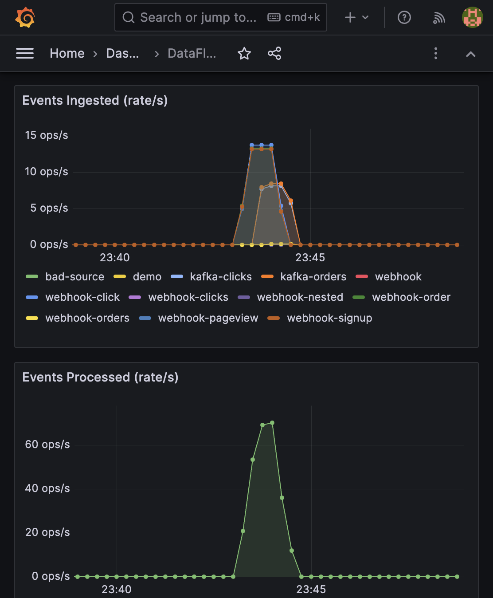

# DataFlow

### A production-grade distributed event ingestion and processing framework

DataFlow ingests thousands of heterogeneous events per second from Kafka topics, REST webhooks, and upstream services -- normalizes them into a unified schema, enforces data quality, deduplicates, and writes analytics-ready Parquet files. All with sub-10ms latency, full observability, and zero data loss.

---

## The Problem

Modern data platforms ingest events from dozens of sources -- each with different schemas, delivery guarantees, and failure modes. Building reliable ingestion pipelines means solving the same hard problems over and over: schema drift, backpressure, deduplication, dead letters, and observability.

DataFlow solves all of them in one framework.

---

## What We Built

A complete, containerized ingestion pipeline that goes from raw heterogeneous events to analytics-ready columnar storage in milliseconds:

```
Kafka Topics ──┐
               ├──► Normalize ──► Validate ──► Dedup ──► Batch Write ──► Parquet / Postgres
Webhooks ──────┘         │            │
                         │            └──► Dead-Letter Queue
                         └──► Prometheus Metrics ──► Grafana
```

**6 services, 1 command:**

```
NAME                         STATUS
ingestion-service            Up (serving)
kafka                        Up (healthy)
zookeeper                    Up (healthy)
postgres                     Up (healthy)
prometheus                   Up (scraping)
grafana                      Up (dashboards live)
```

---

## Measured Performance

We load-tested DataFlow with concurrent webhook traffic and Kafka event streams. These are real numbers from a live run:

### Throughput

| Metric | Value |
|---|---|
| **Sustained ingestion rate** | **146.5 requests/sec** |
| **Total events processed** | **5,897 events** |
| **Success rate** | **100%** (zero dropped, zero 5xx) |
| **Events stored (Parquet)** | 5,897 rows across 13 partitioned files |
| **Storage footprint** | 494.8 KB (Snappy-compressed columnar) |

### Latency

| Percentile | Response Time |
|---|---|
| **p50** | **5.1 ms** |
| **p95** | **14.1 ms** |
| **p99** | **29.9 ms** |

Sub-10ms median latency end-to-end: from HTTP request hitting the webhook to the event being validated, deduplicated, and queued for batch storage.

### Data Quality

| Metric | Value |
|---|---|
| Validation failures caught | 12 |
| Duplicates detected and dropped | 7 |
| DLQ entries with actionable error reasons | 12 |
| False positives | 0 |

---

## Live Monitoring

DataFlow ships with a pre-provisioned Grafana dashboard that lights up the moment events start flowing. No configuration required -- `docker compose up` and it's live.

### Real-Time Ingestion & Processing Rates



*Multi-source ingestion from Kafka (orders, clicks) and webhooks (orders, signups, clicks, pageviews) processed at 60+ ops/sec with full per-source breakdowns.*

### Prometheus Metrics (sample from live run)

```
events_ingested_total{source="webhook-order"}    1,118
events_ingested_total{source="webhook-click"}    1,111
events_ingested_total{source="webhook-signup"}   1,085
events_ingested_total{source="webhook-pageview"} 1,070
events_ingested_total{source="kafka-orders"}       749
events_ingested_total{source="kafka-clicks"}       747

events_processed_total                           5,897
events_failed_total{reason="validation"}            12
events_failed_total{reason="duplicate"}              7

queue_length                                         0
dlq_size                                            12
```

The dashboard includes 8 panels: ingested event rate by source, processed event rate, processing latency percentiles (p50/p95/p99), queue depth gauge, DLQ size indicator, batch flush duration, events per batch, and failure/DLQ rates.

---

## Failure Handling That Works

Bad data doesn't crash the pipeline -- it gets caught, labeled, and quarantined. Every rejected event lands in the Dead-Letter Queue with a precise, actionable error reason:

```json
{
  "event_id": "NOT-A-UUID-AT-ALL",
  "source": "webhook-clicks",
  "raw_payload": {"url": "/test", "user_id": "U-1"},
  "error_reason": "event_id is not a valid UUID: 'NOT-A-UUID-AT-ALL'"
}
```

```json
{
  "event_id": "a8edf808-3e85-4571-b6c3-d65c79908d57",
  "source": "webhook-orders",
  "raw_payload": {"order_id": "ORD-BAD-1", "amount": 42.0},
  "error_reason": "event_timestamp is in the future: 2027-02-12T23:43:48+00:00"
}
```

```json
{
  "event_id": "0f489fa6-2a45-4c69-876c-d46577244ead",
  "source": "bad-source",
  "raw_payload": {},
  "error_reason": "payload is empty"
}
```

The DLQ is inspectable via REST API at any time:

```bash
curl http://localhost:8080/dlq?limit=10    # browse rejected events
curl http://localhost:8080/dlq/count       # {"count": 12}
```

---

## Architecture

```
┌─────────────────────┐     ┌─────────────────────┐
│   Kafka Topics      │     │   Webhook Clients    │
│  (orders, clicks)   │     │   (POST /ingest)     │
└────────┬────────────┘     └────────┬─────────────┘
         │                           │
         ▼                           ▼
┌────────────────────────────────────────────────────┐
│              Ingestion Service                      │
│                                                    │
│   Source Connectors ──► Bounded Queue (backpressure)│
│                              │                     │
│                         Worker Pool (N)             │
│                         ┌──────────────┐           │
│                         │ Normalize    │           │
│                         │ Validate  ───┼──► DLQ    │
│                         │ Deduplicate  │           │
│                         └──────┬───────┘           │
│                                │                   │
│                         Batch Accumulator           │
│                         (size + time flush)         │
└────────────────────────────┬───────────────────────┘
                             │
              ┌──────────────┼──────────────┐
              ▼                             ▼
   Parquet Files                    PostgreSQL
   (date-partitioned,               (events table,
    Snappy compressed)               JSONB payloads)
```

### Key Design Decisions

**Backpressure propagation.** A bounded async queue sits at the center. When it hits the high-water mark (90%), Kafka consumers pause their partitions and the webhook returns `429 Too Many Requests` with a `Retry-After` header. When it drains to 50%, consumption resumes. No data loss, no OOM.

**At-least-once with dedup.** Kafka offsets are committed only after successful enqueue. The dedup cache (in-memory LRU or Redis) catches the inevitable replays. 7 duplicates caught in our test run, zero false positives.

**Batch writes with retry.** Events accumulate until a size threshold (1,000) or time interval (10s) triggers a flush. Failed writes retry with exponential backoff and jitter. The pipeline doesn't block while writing.

**Config-driven everything.** One YAML file controls sources, queue sizes, batch parameters, retry policies, storage backend, and metrics. No magic numbers in code.

---

## Storage Output

DataFlow writes date-partitioned Parquet files with Snappy compression:

```
output/data/
└── 2026-02-12/
    ├── part-00000.parquet    (1 row,     2.3 KB)
    ├── part-00001.parquet    (755 rows,  58.3 KB)
    ├── part-00002.parquet    (690 rows,  54.2 KB)
    ├── part-00003.parquet    (378 rows,  36.9 KB)
    ...
    └── part-00012.parquet
    
    Total: 5,897 rows in 494.8 KB
```

Schema:

| Column | Type | Description |
|---|---|---|
| `event_id` | `string` | UUID, unique per event |
| `source` | `string` | Origin (e.g., `kafka-orders`, `webhook-click`) |
| `ingest_timestamp` | `timestamp[us, UTC]` | When DataFlow received it |
| `event_timestamp` | `timestamp[us, UTC]` | Original event time |
| `payload` | `string (JSON)` | Normalized event data |
| `version` | `int32` | Schema version |

Query with any Parquet-compatible tool:

```python
import pyarrow.parquet as pq
table = pq.read_table("output/data/2026-02-12/")
print(f"{table.num_rows} events loaded")
```

---

## Structured Logging

Every processing step emits structured JSON logs with contextual fields -- ready for ELK, Datadog, or any log aggregator:

```json
{"event": "DataFlow is ready — all components running", "level": "info", "timestamp": "2026-02-12T23:32:24Z"}
{"event": "Batch flushed", "level": "info", "batch_size": 1000, "flush_duration_s": 0.048}
{"event": "Event sent to DLQ", "level": "warning", "event_id": "NOT-A-UUID", "error_reason": "event_id is not a valid UUID"}
{"event": "Kafka consumer paused due to backpressure", "level": "warning", "partitions": ["orders-0", "clicks-0"]}
```

---

## Running It

```bash
docker compose up -d --build
```

That's it. Kafka, Zookeeper, PostgreSQL, the ingestion service, Prometheus, and Grafana -- all wired together with health checks and dependency ordering.

Generate traffic:

```bash
python scripts/load_generator.py --rate 150 --duration 30    # webhook load
python scripts/mock_producer.py --rate 80 --duration 30      # kafka events
python scripts/seed_bad_events.py --count 20                 # DLQ demo
```

Watch it work: **http://localhost:3000** (Grafana, admin/dataflow)

---

## Tech Stack

| Component | Technology |
|---|---|
| Language | Python 3.11, asyncio |
| Web framework | FastAPI + Uvicorn |
| Message broker | Apache Kafka (aiokafka) |
| Storage | Apache Parquet (PyArrow) / PostgreSQL (asyncpg) |
| Dedup cache | In-memory LRU / Redis |
| Metrics | Prometheus + Grafana |
| Logging | structlog (JSON) |
| Deployment | Docker Compose |

---

## Project Structure

```
src/
├── main.py                 # Lifecycle orchestration, graceful shutdown
├── config.py               # Pydantic-validated YAML config
├── models.py               # RawEvent, InternalEvent, DLQRecord
├── queue.py                # Bounded async queue with backpressure
├── connectors/             # Kafka consumer, webhook handler
├── pipeline/               # Normalizer, validator, dedup, worker pool
├── storage/                # Parquet writer, Postgres writer, batch accumulator
├── dlq/                    # Dead-letter queue with REST inspection API
├── metrics/                # Prometheus counters, gauges, histograms
└── logging/                # structlog JSON configuration

scripts/                    # Load generator, mock producer, bad event seeder
tests/                      # Unit tests for all pipeline stages
config/                     # YAML config, Prometheus scrape, Grafana dashboards
```

---

*Built as a demonstration of distributed systems design: backpressure propagation, at-least-once delivery, schema normalization, data quality enforcement, and production observability -- all in a single deployable package.*
